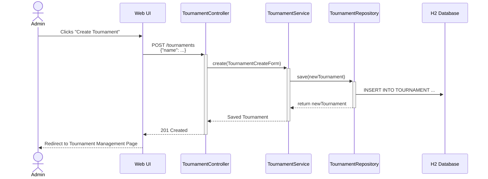
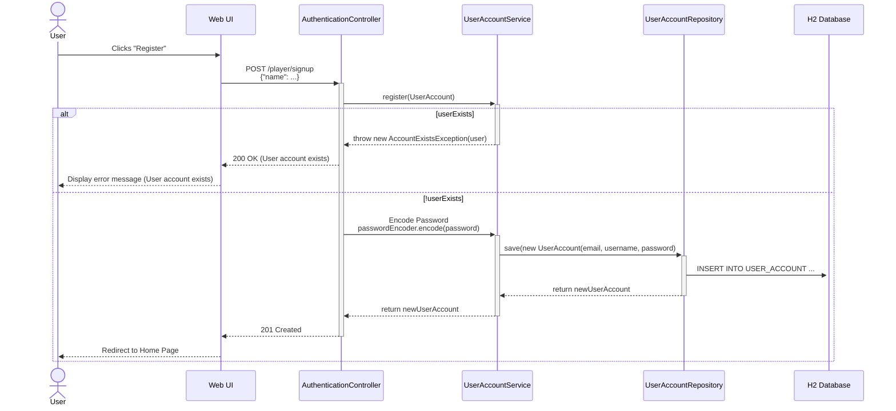

# Create a new tournament

```mermaid
sequenceDiagram
    actor Admin
    Admin->>Web UI: Clicks "Create Tournament"
    Web UI->>+TournamentController: POST /tournaments <br> {"name": ...}
    TournamentController->>+TournamentService: create(TournamentCreateForm)
    TournamentService->>+TournamentRepository: save(newTournament)
    TournamentRepository->>+H2 Database: INSERT INTO TOURNAMENT ... 
    TournamentRepository-->>-TournamentService: return newTournament
    TournamentService-->>-TournamentController: Saved Tournament
    TournamentController-->>-Web UI: 201 Created
    Web UI-->>Admin: Redirect to Tournament Management Page
```

# Register for an account

```mermaid
sequenceDiagram
    actor User
    User->>Web UI: Clicks "Register"
    Web UI->>+AuthenticationController: POST /player/signup <br> {"name": ...}
    AuthenticationController->>+UserAccountService: register(UserAccount)
    alt userExists
        UserAccountService-->>-AuthenticationController: throw new AccountExistsException(user)
        AuthenticationController-->>Web UI: 200 OK (User account exists)
        Web UI-->>User: Display error message (User account exists)
    else !userExists
        AuthenticationController->>+UserAccountService: Encode Password <br/> passwordEncoder.encode(password)
        UserAccountService->>+UserAccountRepository: save(new UserAccount(email, username, password)
        UserAccountRepository->>+H2 Database: INSERT INTO USER_ACCOUNT ...
        UserAccountRepository-->>-UserAccountService: return newUserAccount
        UserAccountService-->>-AuthenticationController: return newUserAccount
        AuthenticationController-->>-Web UI: 201 Created
        Web UI-->>User: Redirect to Home Page
    end
```

