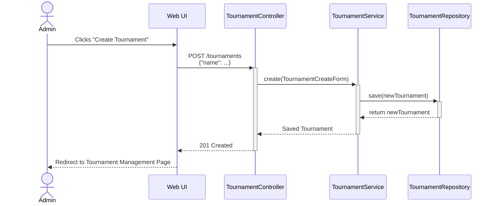
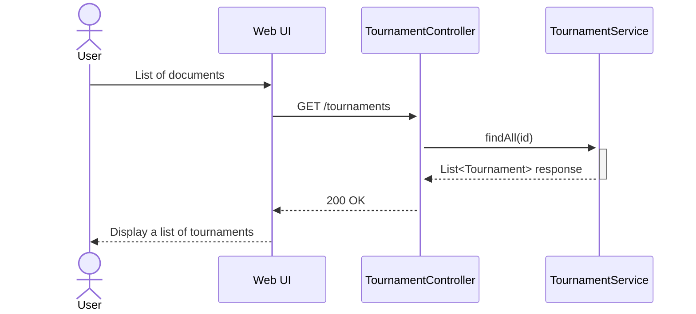
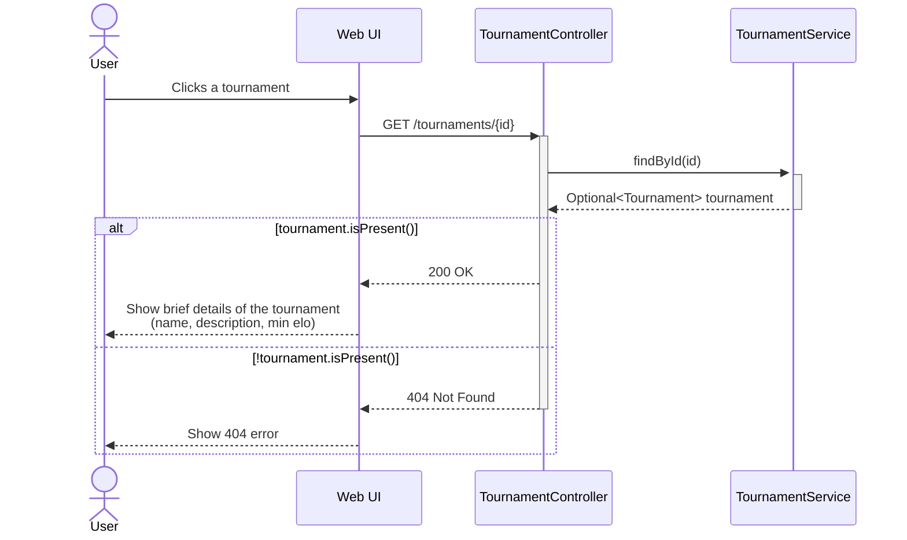
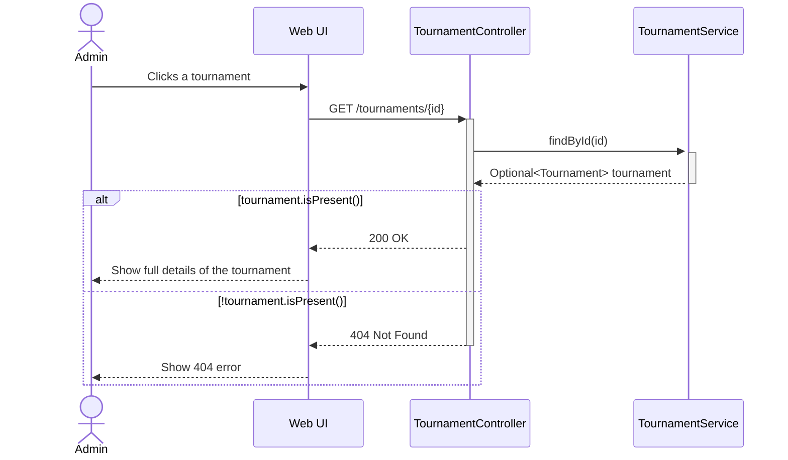
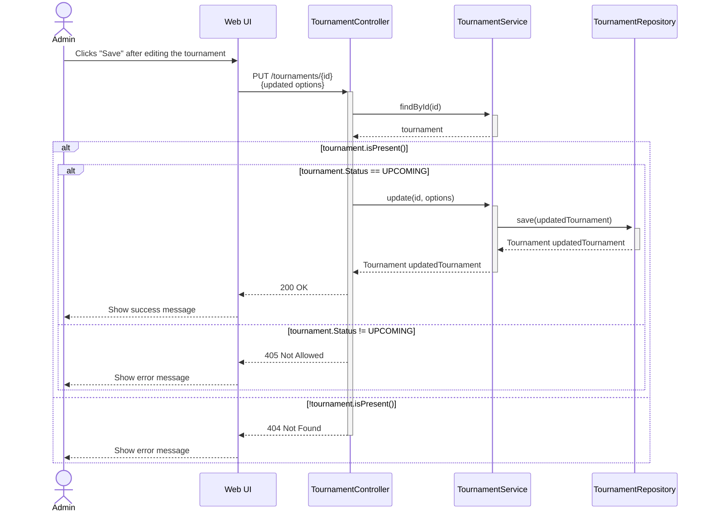
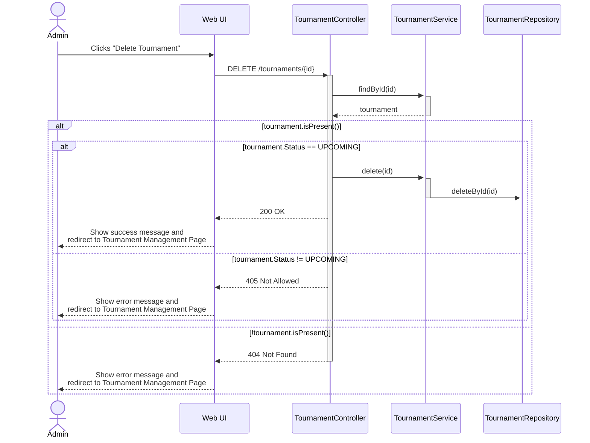

# Create a new tournament

# Browse all tournaments

# Get details of a specific tournament (Non-admin)

# Get details of a specific tournament (Admin)
> TODO: Check if admin is authorized to access the tournament.

# Update a tournament
> TODO: Check if admin is authorized to edit the tournament.

# Delete a tournament
