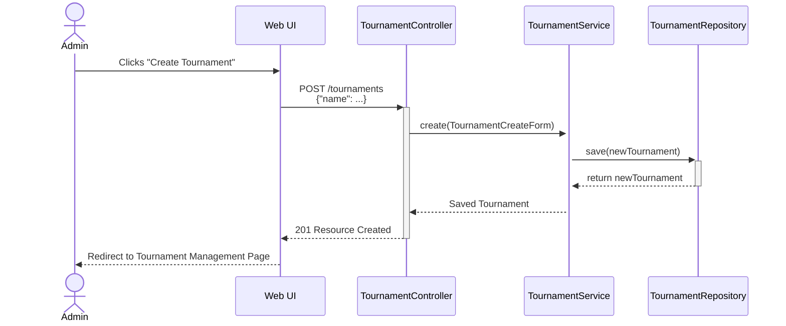

```mermaid
sequenceDiagram
    actor Admin
    Admin->>Web UI: Clicks "Create Tournament"
    Web UI->>+TournamentController: POST /tournaments <br> {"name": ...}
    TournamentController->>+TournamentService: create(TournamentCreateForm)
    TournamentService->>+TournamentRepository: save(newTournament)
    TournamentRepository-->>-TournamentService: return newTournament
    TournamentService-->>TournamentController: Saved Tournament
    TournamentController-->>-Web UI: 201 Resource Created
    Web UI-->>Admin: Redirect to Tournament Management Page 
```